# Pub2Hub — Neo-Brutalist Blog Editor for GitHub

**Write posts. Click publish. Done.**  
No CMS. No backend. No subscriptions.

👉 Live demo: https://monapdx.github.io/publish-to-github/  
👉 Get it on Gumroad: [Get It Now](https://ashpdx.gumroad.com/l/lvsnmfb)

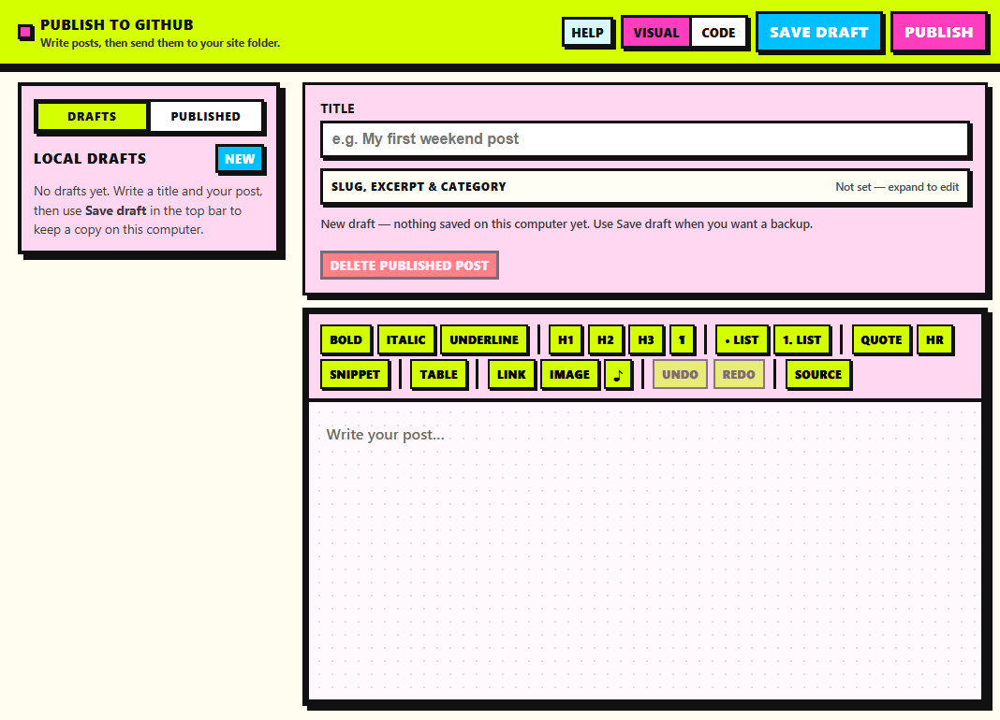

A browser-based editor that publishes **plain HTML** straight into **your** GitHub repository. Posts live as files you own; GitHub Pages serves the `blog/` folder as your site.

---

## Quick overview

| Step | What happens |
|------|----------------|
| 1 | Connect GitHub (username, repo, branch, token) — saved in **this browser only** |
| 2 | Write in Visual or Code mode; **Save draft** keeps a local backup |
| 3 | **Publish** creates/updates `blog/posts/{slug}.html` and updates `blog/index.html` |
| 4 | First publish bootstraps `blog/`, styles, and a GitHub Actions workflow |
| 5 | Enable **Settings → Pages → GitHub Actions** once, then visit your site URL |

The **Published** sidebar updates immediately after publish or delete (optimistic UI). It reads from the **GitHub repo API**, not the live Pages URL, so deployment lag does not hide new posts.

---

## Download and run on Windows

You need **Node.js** (LTS from [nodejs.org](https://nodejs.org/)) once per computer.

1. Download this repo (ZIP or clone).
2. Extract to a folder you can find (Desktop, Documents, etc.).
3. Double-click **`install.bat`** — wait until it finishes.
4. Double-click **`start.bat`** — keep the window open; the browser opens the editor (usually `http://localhost:5173/`).

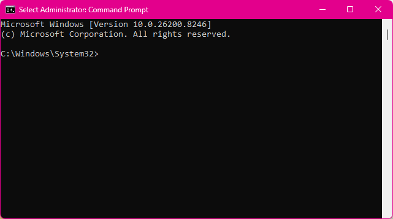

On first launch, the **welcome** screen asks for GitHub connection details. Use **Help** in the top bar anytime for token steps, blog layout, and troubleshooting.

To stop: close the browser tab and the `start.bat` window (or Ctrl+C in that window).

---

## Who this is for

- You want **files in a repo**, not a hosted CMS  
- You use (or want) **GitHub** and **GitHub Pages**  
- You like a **visual editor** but want **raw HTML** when needed  
- You do not want another subscription or platform lock-in  

## What this is not

- Not a hosted blogging platform  
- Not WordPress-in-a-box  
- Not a general static-site generator — layout is **fixed** under `blog/`  

---

## Blog layout (fixed)

Every publish uses the same structure:

```text
blog/
  index.html          ← homepage + post cards
  style.css
  .nojekyll
  posts/
    my-post.html      ← one file per post
.github/workflows/deploy-blog-pages.yml   ← added on first publish
```

Bundled templates (in the app, not uploaded as a folder):

- `templates/post-page-template.html` — full post pages  
- `templates/post-card-template.html` — cards on the homepage  
- `templates/index.html` — starter homepage design  

Homepage listing uses marker comments (invisible on the public site):

```html
<!-- BLOG_POSTS_START -->
<!-- BLOG_POSTS_END -->
```

New cards are inserted between these markers (newest first). Code view includes tools to check markers and edit homepage HTML.

---

## Editor

### Visual and Code modes

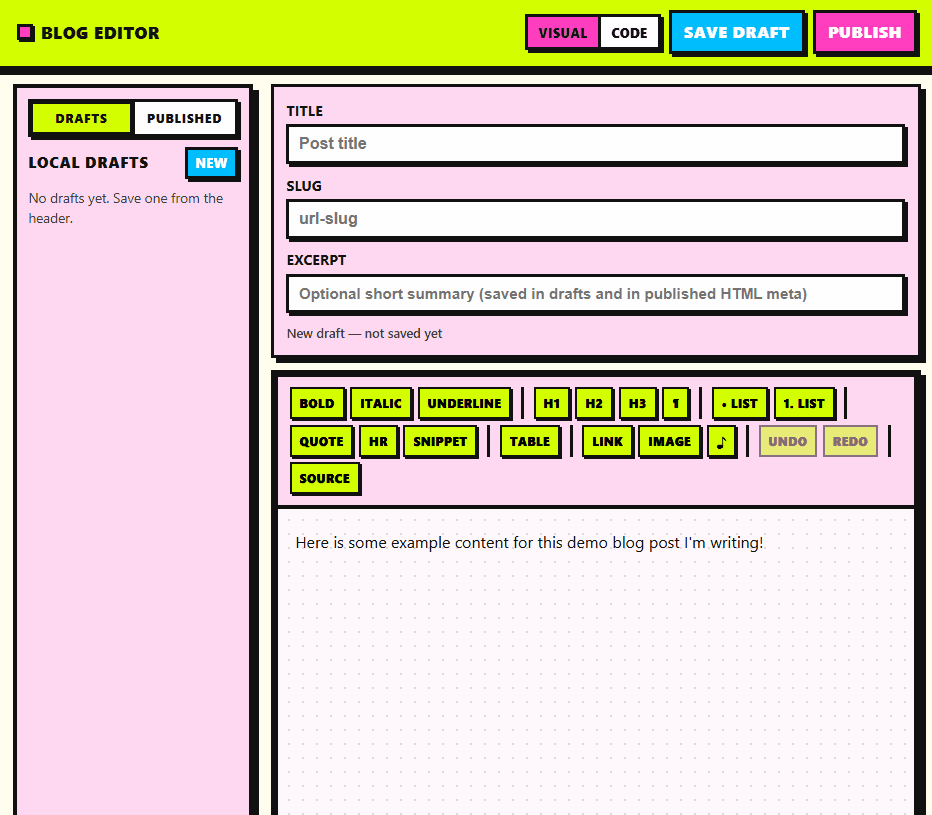

- **Visual** — [TipTap](https://tiptap.dev/) v3: headings, lists, quotes, links, images, tables, code blocks, undo/redo. **Ctrl/Cmd+S** saves the current draft.  
- **Code** — raw HTML for the post body, plus an optional **post template** panel (advanced sections collapsed by default).

### Toolbar

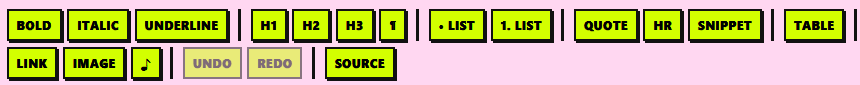

| Feature | Screenshot |
|---------|------------|
| Text formatting | 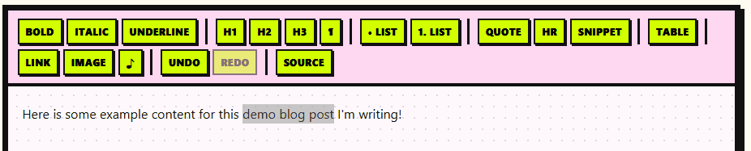 |
| Insert table | 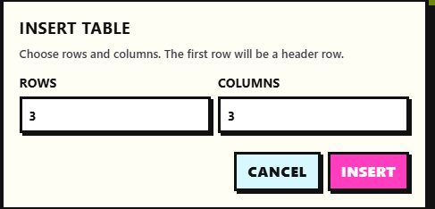 |
| Upload media | 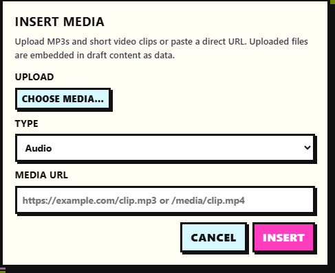 |
| Code snippet | 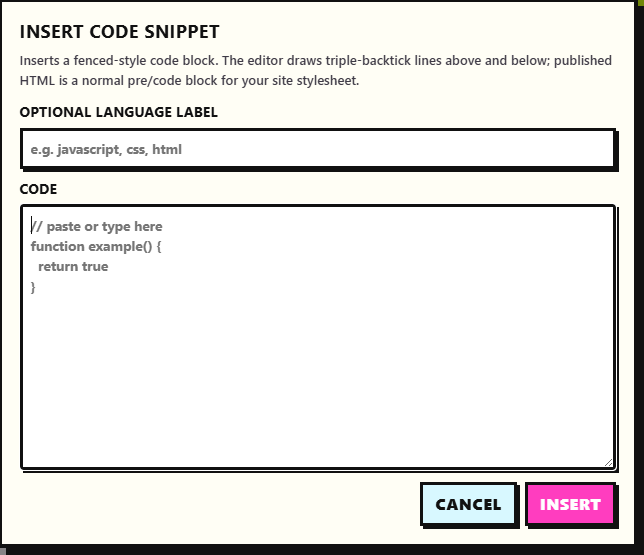 |
| Image | 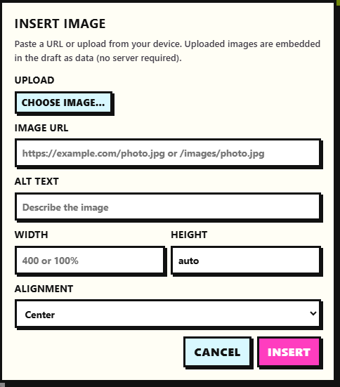 |

Tables support add/remove rows and columns. Images support URL or file upload (data URL in drafts), alt text, size, and alignment. Code snippets export as normal `<pre><code>` blocks.

### Post meta

Under the title: collapsible **slug, excerpt, and category**. Excerpt and category can appear on homepage cards and in optional `blog-editor:*` meta tags for round-trip editing.

### Code view — templates (advanced)

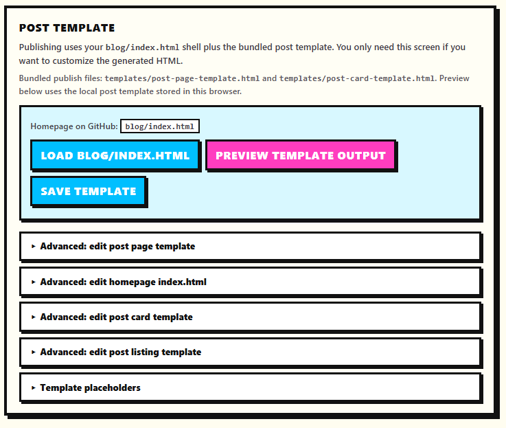

Publishing always uses the **bundled** post page and card templates. Code view is for preview, optional local template tweaks, loading `blog/index.html` from GitHub, and editing homepage/listing HTML in collapsed **Advanced** sections. See in-app **Help** for placeholders and markers.

---

## Sidebar: Drafts and Published

### Drafts (local)

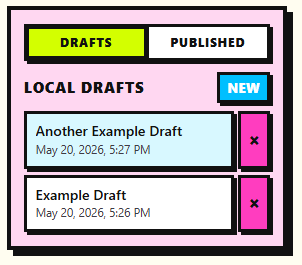

- Stored in **browser `localStorage`** on this computer only  
- **New**, open, delete, **Save draft**, and idle **autosave**  
- Clear message if storage is full  

### Published (GitHub)

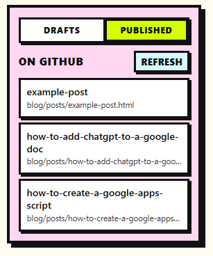

- Lists `.html` files in `blog/posts/` via the **GitHub Contents API**  
- **Refresh** reloads from the repo (button shows “Refreshing…”, toast on success or error)  
- Open a post to edit and publish again (same file path)  
- **Delete Published Post** removes the file and homepage card (with confirmation); sidebar updates immediately  
- After publish, the new/updated post appears at the top **without** waiting for Pages deployment  

Opening a published file **sanitizes** body HTML (DOMPurify) before loading into the editor.

---

## Publishing

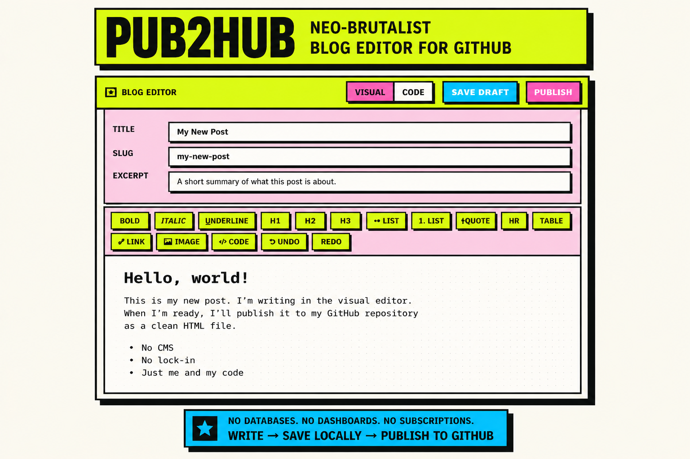

1. Click **Publish** in the header.  
2. Confirm username, repository, branch, and personal access token.  
3. Click **Publish to GitHub**.

The app will:

- Bootstrap `blog/` and the Pages workflow on first publish  
- Write `blog/posts/{slug}.html` from the bundled post template  
- Fetch `blog/index.html`, insert or update the post card between markers, and save  
- Show a clear error if the post saved but the index could not be updated  

**One-time:** In the repo on GitHub, open **Settings → Pages** and set **Build and deployment** source to **GitHub Actions**, then run **Deploy blog to GitHub Pages** under the Actions tab.

Connection settings save to `localStorage` after a successful publish or **Save connection settings**.

---

## Help

**Help** in the header opens a short, scannable guide:

- **Quick start** (always visible)  
- Collapsible sections: blog structure, token setup, editing published posts, common problems, advanced details  

No account data is sent to a third-party server — only GitHub’s API, using your token from the browser.

---

## Mobile

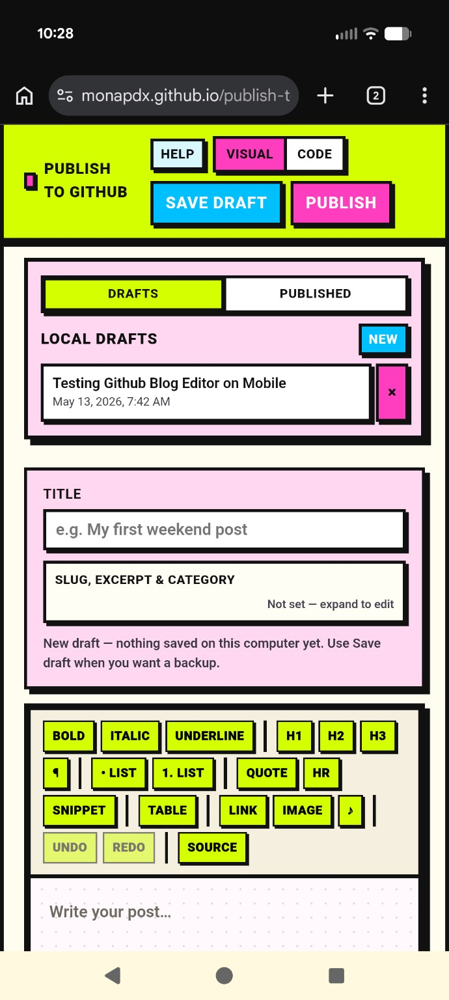

Usable on smaller screens; writing and publishing are easiest on desktop.

---

## Developers

```bash
npm install
npm run dev
```

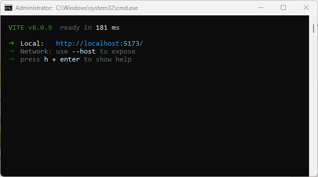

| Script | Purpose |
|--------|---------|
| `npm run dev` | Local dev server (Vite) |
| `npm run build` | Production build |
| `npm run preview` | Preview production build |
| `npm run lint` | ESLint |
| `npm test` | Vitest (blog index, publish helpers, sanitization, GitHub messages) |

CI runs lint, tests, and build on push/PR (`.github/workflows/ci.yml`).

### GitHub token

**Fine-grained (recommended)** on the target repo:

- **Contents** — Read and write  
- **Metadata** — Read-only  
- **Workflows** — Read and write (first publish adds the deploy workflow)  

**Classic** alternative: `repo` scope (`ghp_…`).

Use the repo **owner** (your username or org name), not a personal username for an org-owned repo.

---

## Stack

- React 19, Vite 8, ESLint 9, Vitest  
- TipTap 3 (StarterKit, Link, Underline, Image, Placeholder, Table)  
- DOMPurify when opening published HTML  
- GitHub REST API for file create/update/delete and directory listing  

---

## Why this exists

- No database  
- No dashboard lock-in  
- No subscription — you pay for the tool once if you buy on Gumroad  
- **Write → Save locally → Publish to GitHub → Files you control**
